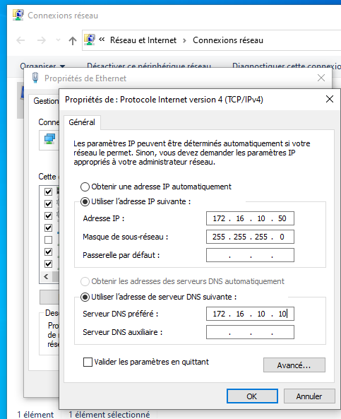
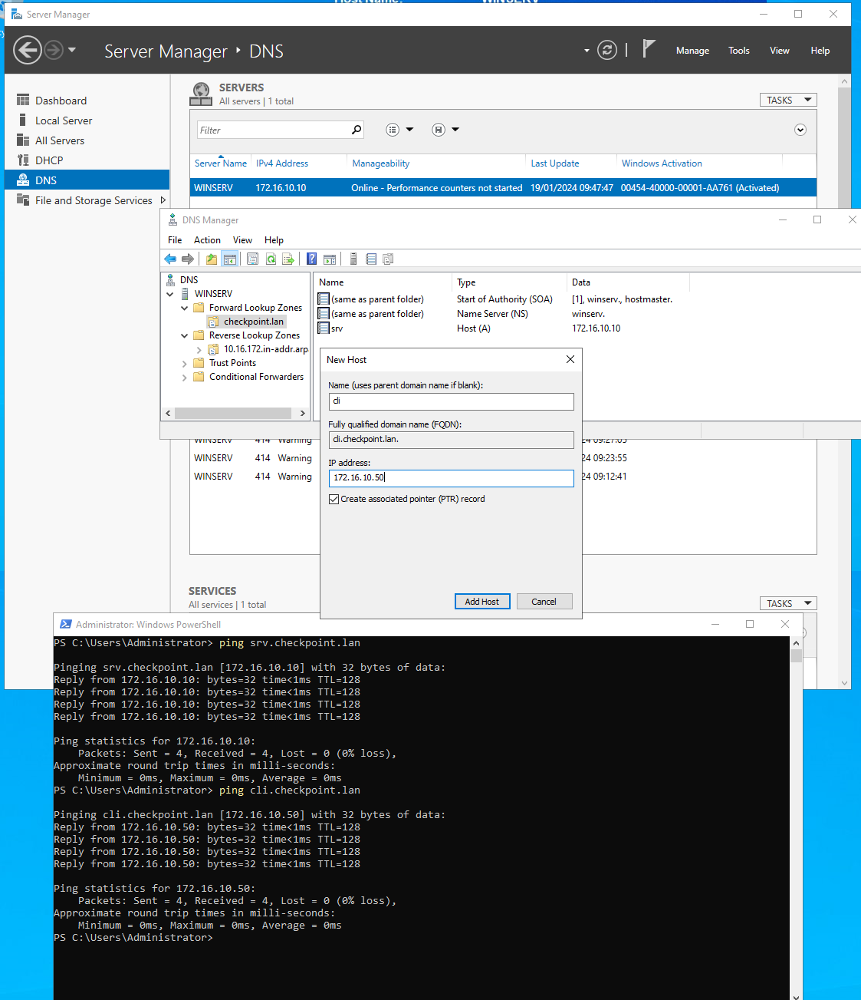
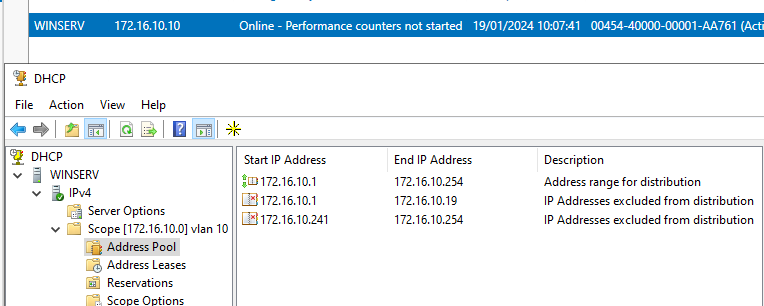
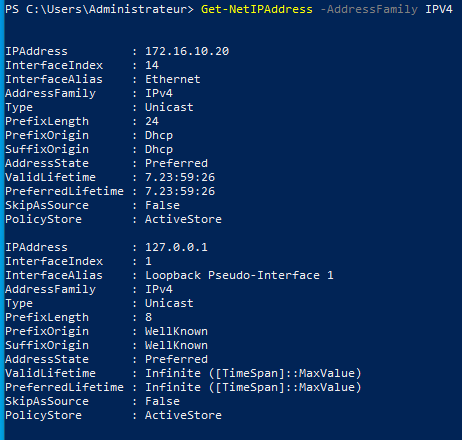
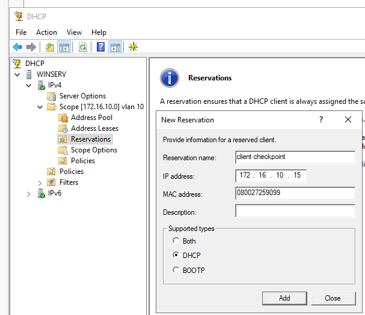
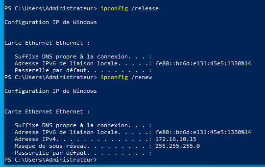

PC Serveur :

- Nom de la VM dans VirtualBox : `Checkpoint2-SRVWIN2022`
- Nom : `WINSERV`
- OS : `Windows Server 2022`
- RAM : `8 Go`
- Processeurs : `2`
- Compte d'administration : `Administrator / P@ssw0rdAdmin$!2023`
- Rôles installés : `DHCP`, `DNS`
- Adresse IP : `172.16.10.10 /24`

PC Client :

- Nom de la VM dans VirtualBox : `Checkpoint2-CLIWIN10`
- Nom : `CLIENT1`
- OS : `Windows 10`
- RAM : `4 Go`
- Processeurs : `2`
- Compte d'administration : `Administrateur / P@ssw0rdAdminC!2023`
- Compte utilisateur : `Wilder / P@ssw0rdUserC!2023`
- Adresse IP : `172.16.100.50/24`

# Q1.1
Les machines ne sont pas sur le même réseau
- 172.16.10.0/24 pour le SRV
- 172.16.100.0/24 pour le client
Il faut donc faire en sorte que les deux machines soient sur le même réseau.
1. Vérifier dans virtualbox que les cartes réseau soient bien en ```Réseau Interne``` et qu'elles soient sur un réseau du même nom.
2. Ouvrir le panneau de conf sur la partie réseau sur le client
3. ```WIN+R => ncpa.cpl```
4. Ouvrir les propriété de la carte réseau concernée
5. Entrer la bonne configuration réseau
	- IP: ```172.16.10.50```
	- MSR: ```255.255.255.0```
	- Passerelle: ```Vide```
	- DNS: ```172.16.10.10```
6. Valider la config et tester le ping  


# Q1.2
Pour un ping via un nom de machine il faut faire appel à un service DNS
-  Vérifier la configuration DNS sur le serveur
- Dans les paramètres IP de la machine client, lui spécifier l'adresse IP du serveur comme DNS (déjà fait en Q1.1)

1. Ouvrir le DNS Manager sur le serveur concerné
2. Dans "Forward lookup zone" créer une nouvelle zone
	1. choisir Primary
	2. choisir un nom "checkpoint.lan"sfg
	3. valider l'option par défaut
	4. valider l'option par défaut
	5. Valider
3. Dans "Reverse lookup zone" créer une nouvelle zone
	1. choisir Primary
	2. choisir IPV4
	3. entrer l'id du réseau ```172.16.10```
	4. valider l'option par défaut
	5. valider l'option par défaut
	6. Valider
4. Ouvrir la zone ```checkpoint.lan```
5. Ajouter un enregistrement A
	1. Name: Entrer le nom choisi pour la machine ```srv```
	2. IP address: Entrer l'ip de la machine cible ```172.16.10.10```
	3. Cocher créer un PTR associé
	4. Valider
6. Répéter l'opération pour le client  
   
# Q1.3
Sur le client passage en dhcp via :
- ncpa.cpl
- propriétés
- ipv4
- DHCP

Vérification de l'attribution:
- ouvrir Powershell
- ```Get-NetIPAddress -AddressFamily IPV4```
- IPAddress         : 172.16.10.20

Sur le serveur :
- Ouvrir DHCP manager
- IPV4
- Scope 172.16.10.0
- Adress pool
	- on voit un plage étendue de 1 à 254
	- une exclusion de 1 à 19
	- une exclusion de 241 à 254
- Reservations
	- Vide

On peut donc déduire que notre DHCP délivre une plage de 20 à 240, le client à donc bien pris la première adresse disponible  
  
  
  
# Q1.4
Pour attribuer l'ip 172.16.10.15 à la machine plusieurs solutions:
-  rapide mais temporaire en modifiant les tailles des plages exclues
- permanente en ajoutant une réservation

### Ajout d'une réservation:
#### Dans virtualbox 
- lire l'adresse mac de la carte réseau de la machine client (```080027259099```)
#### Sur le serveur
- Ouvrir DHCP Manager
- IPV4
- Scope 172.16.10.0
- Reservation
- New Reservation
	- name : client checkpoint
	- address : 172.16.10.15
	- mac : 080027259099
	- desc : lorem5
	- type : DHCP
#### Sur le client
- Ouvrir powershell
- ```ipconfig /release```
- ```ipconfig /renew```
- L'adresse IP attribuée est bien 172.16.10.15
  
  

